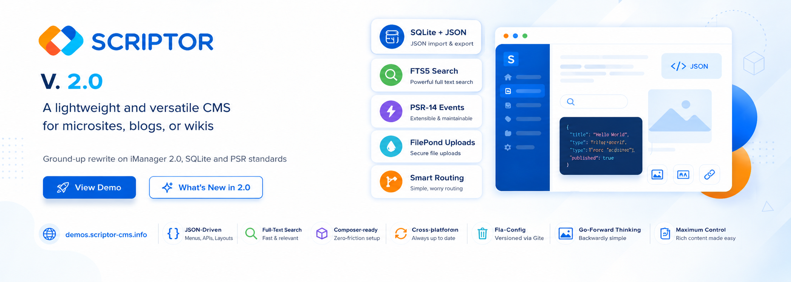

# Scriptor 2.0

Scriptor is a lightweight and versatile CMS for creating microsites, blogs, or
wikis. Version 2 is a ground-up rewrite on top of [iManager 2][imanager],
SQLite and PSR-standards (PSR-3, -14, -16).

Website: [https://scriptor-cms.dev](https://scriptor-cms.dev)  
Demo:    [https://demos.scriptor-cms.dev](https://demos.scriptor-cms.dev)

## Highlights

- **SQLite storage** with JSON columns and FTS5 full-text search.
- **Composer-based** install on top of `bigins/imanager:^2.0`.
- **PSR-14 domain events** drive cache invalidation and file cleanup.
- **FilePond** uploads with on-demand thumbnail generation through
  `intervention/image`.
- **Per-image titles** as a typed `files.title` column with markdown
  caption rendering on the frontend.
- **Single-entry routing** (`public/index.php` delegates
  `/<admin_path>/*` to `editor/index.php` in PHP). Works on Apache,
  Caddy, Nginx, php-S without per-server rewrite rules.
- **`public/` webroot**: source code, the SQLite DB, configs and
  composer artifacts live OUTSIDE the webroot, so a misconfigured web
  server cannot expose them.

## Requirements

- PHP 8.2+ (8.3 recommended)
- Composer 2
- SQLite 3.38+ (for `json_extract`, FTS5)
- Standard PHP extensions: `mbstring`, `dom`, `json`, `gd`, `pdo_sqlite`
- A web server with its document root pointed at `public/` and unknown
  paths routed to `public/index.php`. Apache (`public/.htaccess` is
  shipped), Caddy, Nginx, or PHP's built-in server all work.

## Installation

```bash
git clone git@github.com:bigin/Scriptor.git
cd Scriptor
composer install
php bin/scriptor install
```

`bin/scriptor install` seeds a fresh SQLite database with the Pages
and Users categories, their fields, a Home page, and one admin
user. You will be prompted for an admin password (8+ characters).
The command refuses to run a second time once installed, so it is
safe to leave in a deployment script.

For automation (CI, Docker, scripted provisioning) pass the
password explicitly and skip the confirmation prompt:

```bash
SCRIPTOR_ADMIN_PASSWORD='your-strong-secret' \
  php bin/scriptor install --yes
```

See [`docs/install.md`](docs/install.md) for the full walkthrough,
flag reference, and security notes.

Point your web server at the `public/` directory. For PHP's
built-in server during local development:

```bash
php -S 127.0.0.1:8080 -t public public/index.php
```

For shared hosting where the webroot is fixed (e.g. `public_html/`),
see [`docs/install-shared-hosting.md`](docs/install-shared-hosting.md).

### Try it in Docker

A bundled demo stack starts Scriptor 2.0 on `http://localhost:8080`
with one admin user (`admin / gT5nLazzyBob`) and one example page:

```bash
docker compose up -d --build
```

See [`docs/demo.md`](docs/demo.md) for what the seed creates, how to
reset to factory state, and what the image is (and isn't) good for.

## Admin panel

```
https://your-website.com/editor/
```

Default credentials (change them on first login):

> User: `admin`  
> Password: `gT5nLazzyBob`

## Performance

`bin/perf-smoke.php` runs four canonical timing checkpoints against the
live SQLite database. The budgets (printed in brackets next to each
result) are `getItem < 1 ms`, `getItems(20) < 50 ms`, FTS search
`< 100 ms`. Typical results on the bundled demo data:

```
items()->find(1)                       0.009 ms  [budget   1.0 ms] OK
findByCategory(pages, 0, 20)           0.025 ms  [budget  50.0 ms] OK
FullTextSearch::search("scriptor")     0.037 ms  [budget 100.0 ms] OK
FullTextSearch::count("scriptor")      0.009 ms  [budget 100.0 ms] OK
```

Run it yourself: `php bin/perf-smoke.php`.

## Migrating from 1.x

The iManager 2.0 CLI ships a one-shot migrator that reads the legacy
`data/datasets/buffers/` files into the new SQLite schema and copies
uploads to the post-migration layout:

```bash
# Backup first
cp -a data data.bak.$(date +%F)

# Dry-run
vendor/bin/imanager migrate:from-v1 \
  --source data \
  --target /tmp/imanager-test.db \
  --dry-run

# Real migration
vendor/bin/imanager migrate:from-v1 \
  --source data \
  --target data/imanager.db
```

After the migration finishes you can delete the `data/datasets/buffers/`
directory. The original 1.x uploads stay in `data/uploads/` (untouched);
the migrator copies them into `public/uploads/` for the 2.0 file
storage. `data/uploads/` is safe to remove once you've verified the
migration on the live site.

## Project layout

```
public/                      THE WEBROOT (everything below is web-reachable)
  index.php                  thin front controller
  .htaccess                  Apache fallback (dotfile-deny + front-controller)
  themes/<theme>/            static-only half of each theme (css, fonts, …)
  editor-assets/             editor's CSS, JS, fonts, filepond, images
  uploads/<itemId>/<…>       FilePond uploads, served directly
  favicon.ico                root-level copy for the browser's implicit fetch

boot/                        PSR-4 (Scriptor\Boot\): Frontend, Editor, Events
  Frontend/Site, Page, …     public site renderer + repos
  Editor/Editor, Router, …   admin shell + per-module wiring
  Events/                    domain-event listeners (cache, file cleanup)
  ImanagerBootstrap.php      DI container + service graph
boot.php                     bootstrap include (loaded by public/index.php)

themes/<theme>/              PHP source of each theme: _ext.php, lib/,
                             template.php, vendor/  (NEVER web-served)
modules/                     user-installable site modules
editor/                      admin entry + lang + PHP templates
  index.php                  delegated to from public/index.php
  lang/                      en_US.php, de_DE.php
  theme/                     template.php, header.php, summary.php

data/                        runtime state, NEVER web-served
  settings/                  scriptor-config.php, custom.scriptor-config.php
  imanager.db                SQLite database
  cache/sections/            FilesystemCache (page-level HTML)
  logs/, backups/

bin/                         CLI helpers (currently: perf-smoke.php)
docs/                        themes.md, install-shared-hosting.md, …
```

## Use Scriptor as a library

```php
<?php

use Scriptor\Boot\App;
use Scriptor\Boot\Frontend\Site;

// Loads the autoloader, builds the iManager container on App::container(),
// and populates $config from data/settings/scriptor-config.php.
require __DIR__ . '/boot.php';

$site = new Site(App::container(), $config, __DIR__);

// Data access: read pages directly off the Pages category.
$home = $site->pages()->findHome();          // or ->findBySlug('contact')
echo $home->name;                            // page title
echo $home->content;                         // markdown source

// Theme rendering: resolves $_SERVER['REQUEST_URI'] to a Page and
// returns the same fragments the bundled themes' template.php consumes.
// Call from your own front controller.
$site->execute();
echo $site->render('content');               // page body, rendered + cached
echo $site->render('navigation');            // theme nav
```

See `boot/Frontend/Site.php` for the full set of services the bundled
themes consume.

## Links

- iManager 2 framework: <https://github.com/bigin/imanager>
- Documentation: <https://scriptor-cms.dev/documentation/>
- Modules / extensions: <https://scriptor-cms.dev/extensions/extensions-modules/>
- Demo: <https://demos.scriptor-cms.dev>

[imanager]: https://github.com/bigin/imanager

### Header image by

[Freepik](https://www.freepik.com/free-vector/flat-cms-content-landing-page-style_11817459.htm)

### License

The [MIT License (MIT)](https://github.com/bigin/Scriptor/blob/master/LICENSE)
